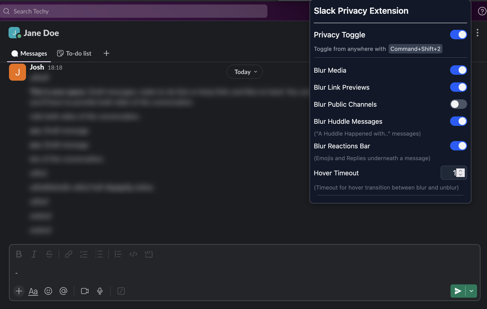

# Slack Privacy Extension

A browser extension that enhances privacy when using Slack in Chrome or Firefox by blurring sensitive content until you hover over it

## 📝 Description

The extension helps protect your privacy while using Slack in a browser by blurring messages, media, and other content until you need to view them. Perfect for those who work in public spaces, frequently share their screen during meetings, or just want an added layer of privacy for their Slack conversations.

## ✨ Features

- **One-Click Privacy Toggle**: Quickly enable or disable privacy mode from the extension popup
- **Global Keyboard Shortcut**: You can also toggle privacy mode with shortcut `Ctrl+Shift+2` (Windows/Linux) or `Command+Shift+2` (Mac). This allows you to toggle message blur instantly without having to click the extension icon from anywhere.

  **Example scenario**: You're in the middle of presenting your screen during a meeting when suddenly you receive a private Slack message. Instead of frantically trying to minimize the window, simply press `Ctrl+Shift+2` (or `Command+Shift+2` on Mac) to immediately blur all private messages. Press the shortcut again to disable privacy mode when you're ready to view your messages.
      
    _Note for Firefox users_: The shortcut functionality is currently not supported globally in Firefox due to browser limitations though it can used when slack tab is in focus. 

- **Selective Content Blurring**: Choose which elements to blur:
  - Message content
  - Media and file attachments
  - Link previews
  - Huddle message notifications
  - Reaction bars (emoji reactions and reply buttons)
  - Public channels (optional - not blurred by default)
- **Hover to Reveal**: Simply hover over any blurred content to temporarily reveal it
- **Customizable Timing**: Adjust how quickly content reveals on hover (from instant to 10 seconds)
- **Smart Channel Detection**: Public channels can remain unblurred by default
- **Lightweight**: Minimal performance impact on your Slack experience

## 🔧 Installation

### Chrome

Available in Chrome Web Store: [Slack Privacy Extension](https://chromewebstore.google.com/detail/bbingmciigmeflfjajcckbkkddddndoh)

For manual installation:
1. Clone or download the repo zip file. Unzip the repo if you downloaded it.
2. Navigate to `path-to-repo/dist/chrome`
3. Open Chrome and navigate to `chrome://extensions/`
4. Enable "Developer mode" by toggling the switch in the top right corner
5. Click "Load unpacked" and select the `/dist/chrome` directory
6. The extension icon should now appear in your browser toolbar

### Firefox

Available in Firefox Add-ons Store: [Privacy Extension for Slack](https://addons.mozilla.org/en-US/firefox/addon/privacy-extension-slack/)

For manual installation:
1. Clone or download the repo zip file. Unzip the repo if you downloaded it.
2. Navigate to `path-to-repo/dist/firefox`
3. Open Firefox and navigate to `about:debugging#/runtime/this-firefox`
4. Click "Load Temporary Add-on..." and select the `manifest.json` file from the `/dist/firefox` directory
5. The extension should now be visible in your add-ons

## 🛠️ Usage

1. Click the extension icon in your browser toolbar to open the settings popup
2. Toggle the main switch to enable/disable privacy mode
3. Default options should be perfect for most users. 
   - If they aren't for you, you can customize which elements should be blurred using the settings - `Blur Link Previews`, `Blur Public Channels` etc. 
   - You can also adjust the hover timeout to control how quickly content reveals when hovered.
4. Use the keyboard shortcut (`Ctrl+Shift+2` or `Command+Shift+2`) to quickly toggle privacy mode from anywhere. 

## ❓ FAQ

### Can I change the keyboard shortcut?

Yes, you can customize the keyboard shortcut in your browser's extension settings:

**For Chrome**:
1. Go to `chrome://extensions/shortcuts` in your address bar
2. Find "Slack Privacy Extension" in the list
3. Click the pencil icon next to the current shortcut
4. Press your desired key combination
5. Click outside the input box to save.

**For Firefox**:
1. Go to `about:addons` in your address bar
2. Click the gear icon and select "Manage Extension Shortcuts"
3. Find "Slack Privacy Extension" in the list
4. Click in the input field and press your desired key combination
5. The shortcut will save automatically

Saved shortcut will reflect in the extension popup UI

### Is my data secure with this extension?

Yes. This extension operates entirely on the client side (your browser) and does not collect, transmit, or store any of your Slack data. It simply applies visual CSS filters to blur content until you hover over it.

### Does this extension work in all Slack workspaces?

Yes, the extension works in all Slack workspaces accessed via a web browser. It doesn't affect the Slack desktop application.

### Why aren't public channels blurred by default?

We've found that most users prefer to keep public channel content visible while blurring direct messages and private channels. You can enable blurring for public channels in the extension settings if desired.

### Will people know I'm using this extension?

No. The extension only affects how Slack appears in your browser and doesn't modify any behavior that would be visible to other Slack users.

### Does the extension work with Slack's dark mode?

Yes, the extension is fully compatible with both light and dark Slack themes.

## 🗓️ Roadmap

- [ ] Auto-enable during screen sharing
- [ ] Context-aware privacy mode (time-based, location-based)
- [ ] Visual indicators for when privacy mode is active
- [ ] Add Additional items that may require blurring such as usernames, user profile pictures, channel names. 
- [ ] Custom blurring for selected channels only

## 🤝 Contributing

Contributions are welcome! Please feel free to submit a Pull Request.

1. Fork the repository
2. Create your feature branch (`git checkout -b feature/xyz-feature-name`)
3. Commit your changes (`git commit -m 'Adds xyz feature'`)
4. Push to the branch (`git push origin feature/xyz-feature-name`)
5. Open a Pull Request

## ⭐ Support

If you find this extension useful, please give it a star on GitHub to show your support!

## ⚠️ Disclaimer

This extension is not affiliated with, endorsed by, or connected to Slack in any way.